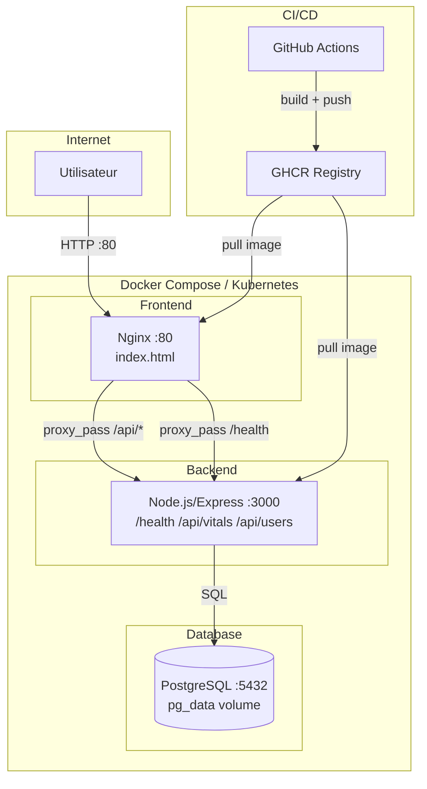

# VytalSync

Application de suivi medical et sportif. Ce depot contient le code source de l'API backend, du frontend web, et toute la chaine DevOps (Docker, CI/CD GitHub Actions, manifestes Kubernetes).

## Architecture



## Prerequis

| Outil | Version minimale |
|---|---|
| Docker | 24+ |
| Docker Compose | 2.20+ |
| Node.js | 20 LTS |
| Git | 2.40+ |
| kubectl (optionnel) | 1.28+ |

## Lancer l'application avec Docker Compose

```bash
# 1. Cloner le depot
git clone https://github.com/skuullking/vytalsync.git
cd vytalsync

# 2. Copier et remplir les variables d'environnement
cp .env.example .env
# Editer .env avec vos propres valeurs (POSTGRES_PASSWORD, etc.)

# 3. Construire et demarrer les 3 services
docker-compose up --build

# Verifier que tout fonctionne
curl http://localhost:3000/health   # -> {"status":"ok",...}
curl http://localhost/              # -> page HTML VytalSync
```

### Commandes utiles

```bash
# Demarrer en arriere-plan
docker-compose up -d --build

# Voir les logs en temps reel
docker-compose logs -f

# Verifier l'etat des conteneurs
docker-compose ps
docker ps

# Arreter et supprimer les conteneurs (le volume pg_data est conserve)
docker-compose down

# Arreter ET supprimer les donnees PostgreSQL
docker-compose down -v
```

## Lancer les tests et le linter

```bash
cd backend
npm install
npm test       # Jest - tests unitaires
npm run lint   # ESLint
```

## Pipeline CI/CD

La pipeline GitHub Actions (`.github/workflows/ci-cd.yml`) s'execute automatiquement sur :
- **push sur `develop`** : feedback immediat apres chaque commit de feature
- **Pull Request vers `main`** : verification obligatoire avant mise en production

### Etapes

```
push/develop  ->  [1. Lint & Tests]  ->  [2. Build & Push GHCR]  ->  [3. Deploy staging + healthcheck]
				   ESLint + Jest          tag: $GITHUB_SHA              curl /health -> fail if not 200
```

1. **Lint & Tests** - installe les dependances Node.js, execute ESLint et Jest. Bloque les stages suivants en cas d'echec.
2. **Build & Push** - construit les images Docker backend et frontend, les tague avec le SHA du commit (`ghcr.io/skuullking/vytalsync-backend:<sha>`), et les pousse vers GHCR.
3. **Deploy staging** - lance les 3 services via `docker-compose up`, attend jusqu'a 60 secondes que `/health` reponde HTTP 200. La pipeline echoue si le backend ne repond pas.

### Secrets GitHub Actions a configurer

| Secret | Role |
|---|---|
| `GITHUB_TOKEN` | Fourni automatiquement par GitHub - authentification GHCR |
| `POSTGRES_PASSWORD` | Mot de passe PostgreSQL pour l'environnement de staging |

## Strategie de branches (Gitflow)

```
main          <- production stable, protegee (PR obligatoire)
  └── develop <- integration continue, declenche la CI
		├── feature/docker-setup
		├── feature/add-endpoint
		└── feature/update-health
```

## Choix techniques

| Choix | Justification |
|---|---|
| **Node.js 20 Alpine** | Image legere (~170 MB vs ~900 MB pour node:20), surface d'attaque reduite |
| **Multi-stage build** | Stage 1 execute les tests, stage 2 ne contient que le code de prod |
| **nginx:alpine** | ~25 MB, serve les fichiers statiques et proxifie `/api/*` vers le backend |
| **PostgreSQL 15 Alpine** | Image officielle legere, volume nomme pour la persistance |
| **Reseau bridge dedie** | Isolation des conteneurs, DNS inter-service par nom (pas d'IP hardcodee) |
| **GitHub Actions** | Natif GitHub, `GITHUB_TOKEN` integre, gratuit pour les repos publics |
| **GHCR** | Integre a GitHub, pas de secret externe, co-localise avec le code |
| **Tag SHA** | Tracabilite exacte vs `latest` ambigu, rollback possible a tout moment |
| **Ingress Kubernetes** | Point d'entree unique HTTP/HTTPS, terminaison TLS centralisee |
| **2 replicas backend** | Tolerance a 1 panne, zero downtime lors des rolling updates |

## Structure du projet

```
vytalsync/
├── backend/
│   ├── server.js          # API Express (health, vitals, users)
│   ├── package.json
│   ├── Dockerfile         # Multi-stage build
│   ├── .dockerignore
│   ├── .eslintrc.json
│   └── test/
│       └── health.test.js
├── frontend/
│   ├── index.html         # Dashboard VytalSync
│   ├── nginx.conf         # proxy_pass /api/* -> backend
│   └── Dockerfile
├── k8s/
│   ├── backend-deployment.yaml
│   ├── backend-service.yaml
│   ├── frontend-ingress.yaml
│   └── db-secret.yaml
├── .github/
│   └── workflows/
│       └── ci-cd.yml
├── docker-compose.yml
├── .env.example
├── .gitignore
└── README.md
```# trigger CI
# trigger CI
